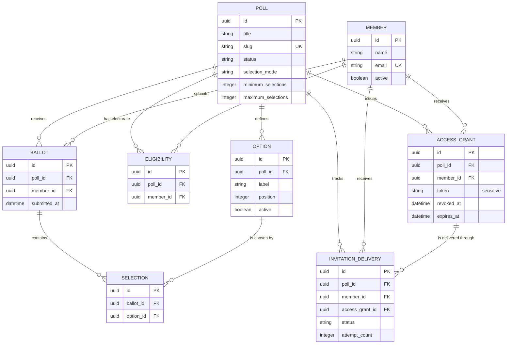

# Querying Polly with IEx

This guide demonstrates common Polly database operations through Ash in an IEx session. Start the application locally with:

```shell
iex -S mix
```

On a Fly.io release, connect to the running application with the release's remote IEx command instead. These examples mutate real data, so confirm which environment and database you are connected to before running them.

## Initial aliases

Run these aliases once at the beginning of the session:

```elixir
alias Polly.Accounts.User
alias Polly.Members.Member
alias Polly.Polls.{AccessGrant, Ballot, Eligibility, InvitationDelivery, Option, Poll, Selection}

require Ash.Query
```

## Resource relationships

The following diagram shows the poll-related resources used throughout this guide:



`Eligibility` is the join resource between a poll and a member. `AccessGrant`, `Ballot`, and `InvitationDelivery` also reference both resources for their respective access, participation, and delivery responsibilities. A ballot's chosen option is represented by `Selection` rather than stored directly on the ballot.

## 1. Create a poll without authorization

Bypassing authorization is appropriate only for trusted maintenance or debugging. Poll creation normally writes an attributed audit event, so an actorless operation must explicitly skip that audit hook:

```elixir
poll =
  Ash.create!(
    Poll,
    %{
      title: "2027 Team Theme",
      description: "Choose the theme for the coming season."
    },
    action: :create_draft,
    authorize?: false,
    context: %{audit: :skip}
  )
```

Polls default to single choice with exactly one required selection:

```elixir
%{
  selection_mode: poll.selection_mode,
  minimum_selections: poll.minimum_selections,
  maximum_selections: poll.maximum_selections
}
# => %{selection_mode: :single, minimum_selections: 1, maximum_selections: 1}
```

To create a multiple-choice draft, include its selection limits:

```elixir
multiple_choice_poll =
  Ash.create!(
    Poll,
    %{
      title: "2027 Community Priorities",
      description: "Choose between two and three priorities.",
      selection_mode: :multiple,
      minimum_selections: 2,
      maximum_selections: 3
    },
    action: :create_draft,
    actor: actor
  )
```

Selection rules must be internally consistent: single-choice polls require `1` and `1`, while multiple-choice limits must be positive and the minimum cannot exceed the maximum. Before a poll opens, its maximum must also fit within the number of active options.

The `:create_draft` action generates a unique slug from the title. Do not supply `:slug` yourself.

Prefer an authorized operation whenever an administrator can be identified. That preserves both policy enforcement and audit attribution.

## 2. Create a poll with authorization

A remote IEx session does not automatically have the signed-in web user. First retrieve the administrator who should be attributed as the actor:

```elixir
actor =
  User
  |> Ash.Query.filter(email == "owner@example.com")
  |> Ash.read_one!(authorize?: false)
```

Then create the draft using that actor:

```elixir
poll =
  Ash.create!(
    Poll,
    %{
      title: "2027 Board Election",
      description: "Select the board representative."
    },
    action: :create_draft,
    actor: actor
  )
```

This enforces the `:manage_polls` permission and records `poll.created` in the audit trail.

## 3. Retrieve a poll

Retrieve one poll by its ID:

```elixir
poll_id = poll.id

poll = Ash.get!(Poll, poll_id, actor: actor)
```

When debugging without an actor:

```elixir
poll = Ash.get!(Poll, poll_id, authorize?: false)
```

You can also query by slug:

```elixir
poll =
  Poll
  |> Ash.Query.filter(slug == "2027-board-election")
  |> Ash.read_one!(actor: actor)
```

Use `Ash.read_one!/2` when one result is expected. `Ash.read!/2` returns a list.

### Update a draft's selection rules

Poll details and selection rules can only be changed through `:update_draft` while the poll remains a draft:

```elixir
poll =
  poll
  |> Ash.Changeset.for_update(
    :update_draft,
    %{
      selection_mode: :multiple,
      minimum_selections: 1,
      maximum_selections: 2
    },
    actor: actor
  )
  |> Ash.update!()
```

Changing the poll title through this action also regenerates its slug while it is a draft. The slug remains stable after the poll opens.

## 4. Add options to the poll

Options can only be added while the poll is a draft:

```elixir
first_option =
  Ash.create!(
    Option,
    %{poll_id: poll.id, label: "Alex Morgan", position: 1},
    actor: actor
  )

second_option =
  Ash.create!(
    Option,
    %{poll_id: poll.id, label: "Jordan Lee", position: 2},
    actor: actor
  )
```

Positions must be unique within a poll. These operations create attributed `poll_option.created` audit events.

## 5. Retrieve the poll's options

Load options onto the existing poll record and assign the returned record:

```elixir
poll = Ash.load!(poll, :options, actor: actor)

poll.options
```

Alternatively, retrieve and load the poll in one query:

```elixir
poll =
  Poll
  |> Ash.Query.filter(id == ^poll_id)
  |> Ash.Query.load(:options)
  |> Ash.read_one!(actor: actor)
```

Ash records are immutable. If the result is not assigned back to `poll`, the previous record may continue to show `Ash.NotLoaded` for its relationships.

## 6. Add a member to the poll electorate

Create or retrieve a reusable member first:

```elixir
member =
  Ash.create!(
    Member,
    %{name: "Jamie Rivera", email: "jamie@example.com"},
    actor: actor
  )
```

Use the electorate service to add the member. It creates both the eligibility snapshot and a private access grant in one transaction:

```elixir
{eligibility, access_grant} =
  Polly.Polls.Electorate.include_member(poll, member, actor)
```

The poll must still be in draft status. Keep access-grant tokens private; they provide direct access to the member's ballot.

If only a raw eligibility record is required for trusted debugging, it can be created directly:

```elixir
eligibility =
  Ash.create!(
    Eligibility,
    %{poll_id: poll.id, member_id: member.id},
    authorize?: false
  )
```

The direct form does not issue an access grant and should not replace `Electorate.include_member/3` in normal application flows.

## 7. Retrieve eligible-member details

Load eligibilities and their members, along with the poll's access grants and their members:

```elixir
poll =
  Poll
  |> Ash.Query.filter(id == ^poll_id)
  |> Ash.Query.load([
    :options,
    eligibilities: [:member],
    access_grants: [:member]
  ])
  |> Ash.read_one!(actor: actor)
```

Inspect the eligible members:

```elixir
Enum.map(poll.eligibilities, fn eligibility ->
  %{
    eligibility_id: eligibility.id,
    member_id: eligibility.member.id,
    name: eligibility.member.name,
    email: eligibility.member.email,
    active: eligibility.member.active
  }
end)
```

`Eligibility` does not directly own an `:access_grants` relationship. Eligibilities and access grants are sibling relationships on `Poll`. Match them using `member_id` when needed:

```elixir
Enum.map(poll.eligibilities, fn eligibility ->
  grants =
    Enum.filter(poll.access_grants, fn grant ->
      grant.member_id == eligibility.member_id
    end)

  %{
    member: eligibility.member,
    eligibility: eligibility,
    access_grants: grants
  }
end)
```

Avoid printing access-grant records in shared terminals or logs because they contain sensitive voting credentials.

## 8. Retrieve access grants

Retrieve every access grant belonging to the poll and load its associated member:

```elixir
access_grants =
  AccessGrant
  |> Ash.Query.filter(poll_id == ^poll_id)
  |> Ash.Query.load(:member)
  |> Ash.Query.sort(inserted_at: :desc)
  |> Ash.read!(actor: actor)
```

For trusted debugging without an actor:

```elixir
access_grants =
  AccessGrant
  |> Ash.Query.filter(poll_id == ^poll_id)
  |> Ash.Query.load(:member)
  |> Ash.Query.sort(inserted_at: :desc)
  |> Ash.read!(authorize?: false)
```

Inspect useful grant details without displaying the private token:

```elixir
Enum.map(access_grants, fn grant ->
  %{
    id: grant.id,
    member_id: grant.member_id,
    member_name: grant.member.name,
    member_email: grant.member.email,
    active: is_nil(grant.revoked_at),
    revoked_at: grant.revoked_at,
    expires_at: grant.expires_at,
    inserted_at: grant.inserted_at
  }
end)
```

Retrieve only grants that have not been revoked:

```elixir
active_access_grants =
  AccessGrant
  |> Ash.Query.filter(poll_id == ^poll_id and is_nil(revoked_at))
  |> Ash.Query.load(:member)
  |> Ash.read!(actor: actor)
```

This filter includes unexpired and expired grants. To retrieve grants that can currently resolve, also account for `expires_at`:

```elixir
now = DateTime.utc_now()

usable_access_grants =
  AccessGrant
  |> Ash.Query.filter(
    poll_id == ^poll_id and
      is_nil(revoked_at) and
      (is_nil(expires_at) or expires_at > ^now)
  )
  |> Ash.Query.load(:member)
  |> Ash.read!(actor: actor)
```

Access-grant tokens are sensitive credentials. Avoid inspecting `grant.token` unless it is necessary, and never paste tokens into logs, screenshots, issue trackers, or shared chat.

## 9. Retrieve poll invitations

Poll invitation activity is persisted as `InvitationDelivery` records. These records track delivery state and attempts without storing the private voting URL:

```elixir
invitation_deliveries =
  InvitationDelivery
  |> Ash.Query.filter(poll_id == ^poll_id)
  |> Ash.Query.load(:member)
  |> Ash.Query.sort(requested_at: :desc)
  |> Ash.read!(actor: actor)
```

Inspect delivery details:

```elixir
Enum.map(invitation_deliveries, fn delivery ->
  %{
    id: delivery.id,
    member_id: delivery.member_id,
    member_name: delivery.member.name,
    status: delivery.status,
    kind: delivery.kind,
    attempt_count: delivery.attempt_count,
    last_error_code: delivery.last_error_code,
    requested_at: delivery.requested_at,
    accepted_at: delivery.accepted_at,
    failed_at: delivery.failed_at
  }
end)
```

Retrieve only failed deliveries:

```elixir
failed_deliveries =
  InvitationDelivery
  |> Ash.Query.filter(poll_id == ^poll_id and status == :failed)
  |> Ash.Query.load(:member)
  |> Ash.Query.sort(failed_at: :desc)
  |> Ash.read!(actor: actor)
```

For trusted debugging without authorization:

```elixir
invitation_deliveries =
  InvitationDelivery
  |> Ash.Query.filter(poll_id == ^poll_id)
  |> Ash.Query.load(:member)
  |> Ash.read!(authorize?: false)
```

The `recipient_email` and `provider_message_id` fields have additional field-level protection. Depending on the actor's permissions, Ash may return those fields as forbidden or redacted. Avoid printing them unless they are required for a specific delivery investigation.

## 10. Retrieve ballots

Retrieve ballots for one poll:

```elixir
ballots =
  Ballot
  |> Ash.Query.filter(poll_id == ^poll_id)
  |> Ash.Query.sort(submitted_at: :desc)
  |> Ash.read!(actor: actor)
```

Count submitted ballots without loading every record:

```elixir
ballot_count =
  Ballot
  |> Ash.Query.filter(poll_id == ^poll_id)
  |> Ash.count!(actor: actor)
```

To investigate the current identified-ballot model, load each ballot's member and selected option:

```elixir
ballots =
  Ballot
  |> Ash.Query.filter(poll_id == ^poll_id)
  |> Ash.Query.load([
    :member,
    selections: [:option]
  ])
  |> Ash.Query.sort(submitted_at: :desc)
  |> Ash.read!(actor: actor)
```

Inspect a constrained representation:

```elixir
Enum.map(ballots, fn ballot ->
  %{
    ballot_id: ballot.id,
    member_id: ballot.member_id,
    member_name: ballot.member.name,
    submitted_at: ballot.submitted_at,
    selections:
      Enum.map(ballot.selections, fn selection ->
        %{
          option_id: selection.option_id,
          option_label: selection.option.label
        }
      end)
  }
end)
```

For trusted debugging without authorization:

```elixir
ballots =
  Ballot
  |> Ash.Query.filter(poll_id == ^poll_id)
  |> Ash.Query.load([:member, selections: [:option]])
  |> Ash.read!(authorize?: false)
```

Ballot data is private. The current identified-ballot model can associate a member with a selection, so do not copy this output into logs, screenshots, tickets, or shared chat. Prefer aggregate result queries unless individual-record debugging is strictly necessary.

### Retrieve selections for a specific poll

`Selection` references a ballot rather than storing `poll_id` directly. Filter through the ballot relationship and load each selected option:

```elixir
selections =
  Selection
  |> Ash.Query.filter(ballot.poll_id == ^poll_id)
  |> Ash.Query.load(:option)
  |> Ash.read!(actor: actor)
```

Inspect a constrained representation:

```elixir
Enum.map(selections, fn selection ->
  %{
    selection_id: selection.id,
    ballot_id: selection.ballot_id,
    option_id: selection.option_id,
    option_label: selection.option.label
  }
end)
```

For trusted debugging without authorization:

```elixir
selections =
  Selection
  |> Ash.Query.filter(ballot.poll_id == ^poll_id)
  |> Ash.Query.load(:option)
  |> Ash.read!(authorize?: false)
```

Only load the ballot member when investigating a specific identified-ballot problem:

```elixir
selections =
  Selection
  |> Ash.Query.filter(ballot.poll_id == ^poll_id)
  |> Ash.Query.load([:option, ballot: [:member]])
  |> Ash.read!(actor: actor)
```

That final query links voters to their choices. Treat its output as highly sensitive and prefer `Polly.Polls.Results.for_poll/1` for normal result inspection.

## 11. Submit a ballot

Use the ballot service rather than creating `Ballot` and `Selection` records independently. The service validates the access grant, poll state, electorate membership, selection limits, selected options, and duplicate submission protection in one transaction.

The poll must be open before it can accept a ballot:

```elixir
poll =
  poll
  |> Ash.Changeset.for_update(:open, %{}, actor: actor)
  |> Ash.update!()
```

Submit one option to a single-choice poll:

```elixir
{:ok, ballot} =
  Polly.Polls.Ballots.submit(
    poll.id,
    access_grant.token,
    [first_option.id]
  )
```

For a multiple-choice poll, pass every selected option ID in one list:

```elixir
{:ok, ballot} =
  Polly.Polls.Ballots.submit(
    multiple_choice_poll.id,
    multiple_choice_access_grant.token,
    [first_choice.id, second_choice.id]
  )
```

Each ballot is final. Submitting too few or too many choices, repeating an option ID, selecting an option from another poll, or submitting a second ballot returns an error and rolls back the transaction.

The scalar form remains temporarily supported for single-choice compatibility:

```elixir
Polly.Polls.Ballots.submit(poll.id, access_grant.token, first_option.id)
```

New code should prefer the list form because it works for both selection modes. Treat `access_grant.token` as a password: do not print it or retain it in shell history unnecessarily.

Load the selections created for a submitted ballot:

```elixir
ballot = Ash.load!(ballot, selections: [:option], authorize?: false)

Enum.map(ballot.selections, fn selection ->
  %{
    selection_id: selection.id,
    option_id: selection.option_id,
    option_label: selection.option.label
  }
end)
```

## 12. Retrieve aggregate results

Use the shared results projection instead of calculating counts independently:

```elixir
results = Polly.Polls.Results.for_poll(poll.id)
```

Inspect poll-level totals:

```elixir
%{
  selection_mode: results.selection_mode,
  eligible_members: results.eligible_count,
  submitted_ballots: results.ballot_count,
  total_selections: results.total_selections,
  turnout_percentage: results.turnout_percentage,
  leading_options: results.winner_labels
}
```

Inspect the aggregate result for each option:

```elixir
Enum.map(results.options, fn result ->
  %{
    option_id: result.option.id,
    label: result.option.label,
    selections: result.votes,
    percentage_of_ballots: result.percentage,
    rank: result.rank,
    leading?: result.winner?
  }
end)
```

Turnout is always submitted ballots divided by eligible members. An option's percentage is the number of submitted ballots that selected it divided by the total submitted ballots.

For single-choice polls, option percentages behave like vote share and normally total 100%. For multiple-choice polls, one ballot can select several options, so `total_selections` may exceed `ballot_count` and option percentages may total more than 100%.

`winner_labels` currently identifies the highest-count option or tied options. It does not apply tie-breaking, quorum, seat-allocation, or election-certification rules.
